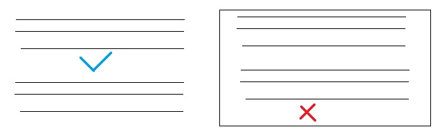
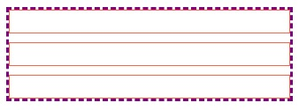

# Problemática:

cuando trabajamos con htm y css, en la creación layout siempre surge la necesidad de la generación de espacios entre los elementos anteriores o siguientes, esto se puede solucionar muy fácilmente con la propiedad margin, el problema surge cuando estos espacios son agregados en los componentes hijos limitando la reutilización de dichos componentes



# Solución:

la solución a este problema es diseñar tomando en cuenta el contexto, en otras palabras, es diseñar un componente de pila que incluya márgenes entre los elementos atreves de un componente padre

```css
.stack > * + * {
  margin-top: 10px;
}
```

[
](https://codepen.io/cruzrovira/pen/MWGGJWq)

# [margin-block-start](https://developer.mozilla.org/en-US/docs/Web/CSS/margin-block-start#:~:text=The%20margin%2Dblock%2Dstart%20CSS,%2C%20directionality%2C%20and%20text%20orientation.)

Esta misma solución la podemos realizar con la propiedad de css `margin-block-start` , es probable que esta propiedad de css no le sea muy conocida, pero es similar a la utilización margin solo que es para realización de espacios entre componentes de tipo bloque de manera vertical.

```css
.stack > * + * {
  margin-block-start: 10px;
}
```
